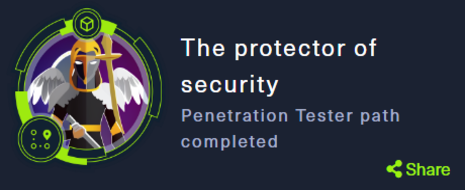
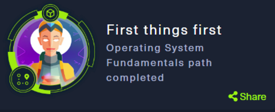
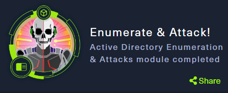
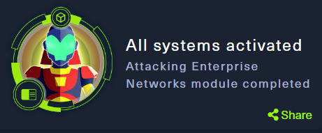
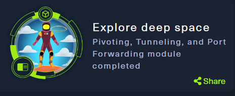

<h1 align="center">Edison Rivera</h1>

* 🏫 Estudiante de Tecnología Superior en Desarrollo de Software en la **Escuela Politécnica Nacional**.
* 👨‍💻 Actualmente aprendiendo: **Ciberseguridad**.
* 📟 Visita mi <a href="https://edisonrivera.github.io/" target="_blank">Página Web</a>
* 📝 Hecha un vistazo a mi [CV](https://epnecuador-my.sharepoint.com/:b:/g/personal/edison_rivera_epn_edu_ec/ETZdOaAfiWRNgTv58clhweIB-qmJ-x9ohwCS_wFRtzOMiQ?e=FcApDQ)
<h3 align="left">🌐 Plataformas Web:</h3>

 

<h3 align="left">👨‍💻 Lenguajes y herramientas:</h3>

 
 

 
 

 

<h3 align="left">📧 Contáctame:</h3>

<a href="mailto:riveraeddy58@gmail.com" target="_blank">

 

<h3 align="left">🥇 Logros:</h3>

 
 
 
 
 

  

