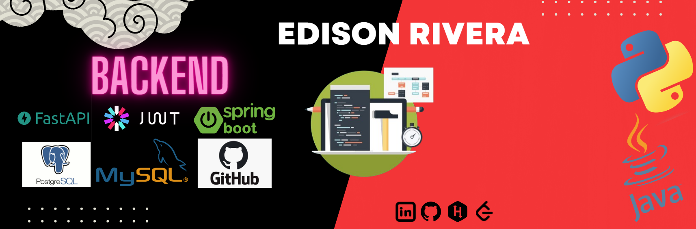

  

Soy un **Desarrollador Backend Junior** con un año de experiencia.

📝 Puedes consultar mi [CV](https://drive.google.com/file/d/1ypGW8ZuFbEstwWKsM1BdeIycsRdVfgj7/view?usp=drive_link)

### Experiencia Laboral 💼

1. Soporte Técnico en [**Escuela Politécnica Nacional**](https://www.linkedin.com/search/results/all/?fetchDeterministicClustersOnly=true&heroEntityKey=urn%3Ali%3Aorganization%3A15093485&keywords=escuela%20polit%C3%A9cnica%20nacional&origin=RICH_QUERY_TYPEAHEAD_HISTORY&position=0&searchId=daf6dd39-e332-466f-9811-a18c4519e1c3&sid=23R&spellCorrectionEnabled=true)

2. Desarrollador de Software Backend en [**Puntonet S.A.**](https://www.linkedin.com/search/results/all/?heroEntityKey=urn%3Ali%3Aorganization%3A10337087&keywords=Puntonet%20S.A.&origin=ENTITY_SEARCH_HOME_HISTORY&sid=hRb)

Desempeñé el rol de desarrollador backend y frontend, mis principales responsabilidades incluían:
  - Desarrollo de API utilizando Java y SpringBoot.
  - Creación de frontends utilizando Angular.
  - Investigación y documentación de sistemas heredados.
  - Trabajo con bases de datos Postgres y SQLServer.
  - Optimización de procesos y tiempos de respuesta.

---

A lo largo de mi experiencia laboral, he desarrollado API's Restful de manera eficiente y robusta. Utilizo Swagger para la documentación, asegurando que las APIs sean fácilmente comprensibles y accesibles para otros desarrolladores. He implementado autenticación con JWT y autorización basada en roles, garantizando la seguridad y control de acceso adecuado a los recursos. 🛡

Además, he optimizado consultas a bases de datos para mejorar el rendimiento de las APIs, asegurando respuestas rápidas y eficientes. He implementado pruebas unitarias y de integración, lo que me permite identificar y solucionar problemas. 😁

---

<h3 align="left">🌐 Plataformas Web:</h3>

 

<h3 align="left">👨‍💻 Lenguajes y herramientas:</h3>

 
 
 

 

<h3 align="left">📧 Contáctame:</h3>

<a href="mailto:riveraeddy58@gmail.com" target="_blank">

 
